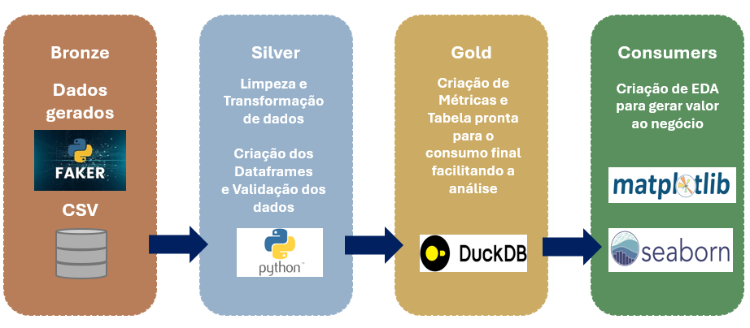

# End-to-End Data Pipeline: Implementando Arquitetura Medalhão com DuckDB

Este projeto consiste na criação de um pipeline de dados completo utilizando a biblioteca **Faker** para gerar dados fictícios de uma academia e o **DuckDB** como motor de processamento e armazenamento, seguindo a **Arquitetura Medalhão**.

## Arquitetura do Projeto
<p align="center">
  
</p>

## Objetivo
Demonstrar habilidades em Engenharia de Dados através da criação de um fluxo que vai desde a geração do dado "cru" até a entrega de insights para o negócio através de análises exploratórias.

### Tecnologias e Ferramentas
* **Linguagem:** Python
* **Banco de Dados:** DuckDB
* **Geração de Dados:** Faker
* **Manipulação e Visualização:** Pandas, Seaborn e Matplotlib

### Estrutura do Projeto (Arquitetura Medalhão)
O projeto está organizado conforme as camadas de dados:

```text
INGESTAO_DUCK_DB/
├── data/
│   └── clientes_academia.csv
├── database/
│   └── medalhao.duckdb
├── notebooks/
│   ├── bronze.ipynb
│   ├── silver.ipynb
│   ├── gold.ipynb
│   └── analises_academia.ipynb
├── scripts/
│   └── gerar_dados_academia.py
├── arquitetura.png
├── README.md
└── requirements.txt
```

* **Geração de Dados (`gerar_dados_academia.py`):** Script Python que utiliza a biblioteca Faker para criar um arquivo CSV simulando o cadastro de alunos.
* **Camada Bronze (`bronze.ipynb`):** Ingestão direta dos dados do CSV para o DuckDB sem transformações, preservando a origem.
* **Camada Silver (`silver.ipynb`):** Limpeza e padronização, incluindo o tratamento de tipos de dados e datas.
* **Camada Gold (`gold.ipynb` / `analises_academia.ipynb`):** Criação de tabelas agregadas e visões de negócio para suporte à decisão.

## Análise Exploratória
Nesta etapa final, foi realizado consultas SQL no DuckDB para gerar insights, como:

* Quantidade de alunos pro plano
* Distribuição de alunos por faixa etária.
* Faturamento total por ano de adesão.
* Faturamento por plano e status.

## Como Executar
1. Instale as dependências: `pip install -r requirements.txt`.
2. Execute o script de geração de dados.
3. Siga a ordem dos notebooks: Bronze -> Silver -> Gold.

---
Desenvolvido por **Amanda**.


